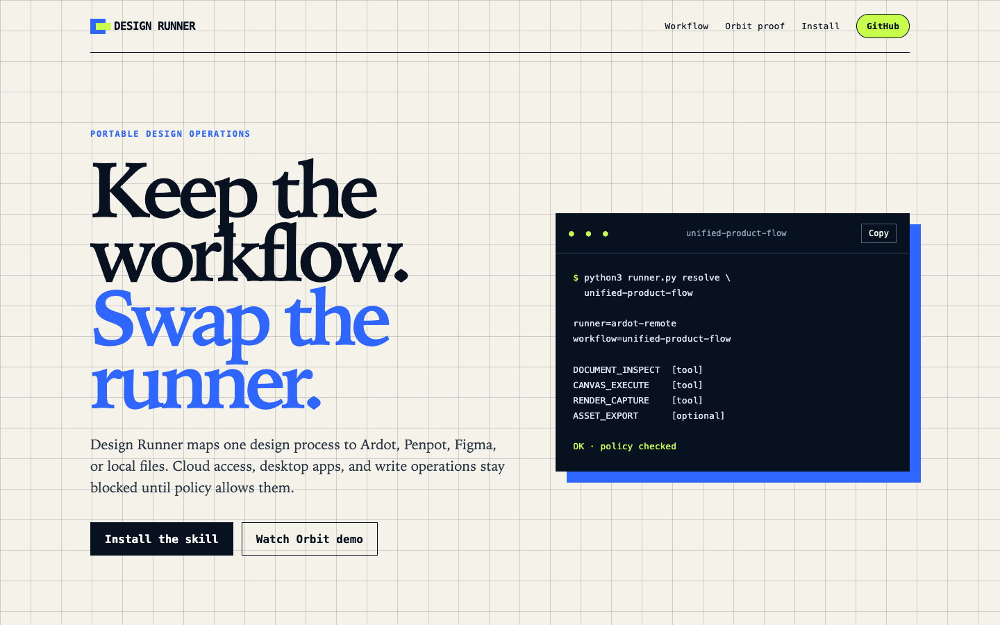
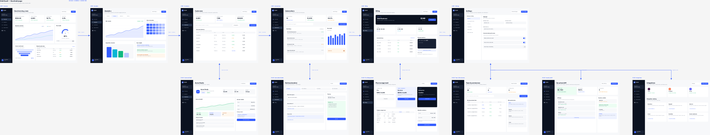

# Design Runner

One portable design workflow for Figma, Tencent Design Ardot, self-hosted Penpot, and local files.

[Live site](https://liush2yuxjtu.github.io/design-runner-skill/) · [Orbit SaaS example](https://liush2yuxjtu.github.io/design-runner-skill/#orbit) · [Skill instructions](SKILL.md)

[](https://liush2yuxjtu.github.io/design-runner-skill/)

Design Runner separates workflow from provider. A workflow asks for capabilities such as document inspection, canvas editing, or rendering. A runner maps those capabilities to real tools and applies a fail-closed policy before any cloud, desktop, or write operation.

Current catalog:

- 5 runners
- 15 workflows
- 8 policy and resolver tests
- GUI-free Ardot Remote support through the included Pi extension

## Install

```bash
git clone https://github.com/liush2yuxjtu/design-runner-skill.git \
  ~/.agents/skills/design-runner
```

Safe local mode needs no configuration. It denies cloud access, desktop apps, and design writes.

```bash
python3 ~/.agents/skills/design-runner/scripts/runner.py check
python3 ~/.agents/skills/design-runner/scripts/runner.py \
  resolve design-to-code
```

## Use Ardot Remote from Pi

The included extension connects Pi to Ardot MCP without opening the Ardot desktop app.

```bash
cp -R ~/.agents/skills/design-runner/extensions/pi-design-mcp \
  ~/.pi/agent/extensions/design-mcp

cd ~/.pi/agent/extensions/design-mcp
npm ci

python3 ~/.agents/skills/design-runner/scripts/runner.py use ardot-remote \
  --project . \
  --cloud allow \
  --desktop deny \
  --design-writes allow
```

Reload Pi once, then run:

```text
/design-mcp connect ardot-remote
```

OAuth state stays outside the repository under Pi's private state directory.

## One-page product flows

`unified-product-flow` turns scattered mocks into one reviewable canvas:

1. Inventory every real screen root.
2. Reuse one existing design page.
3. Move and tile screens without resizing them.
4. Connect navigation, detail, branch, and return routes with labeled arrows.
5. Replace abstract interaction-map pages with those connectors.
6. Verify all roots moved before deleting empty pages.
7. Confirm that one page remains.
8. Export a full-page overview and inspect every connector.

```bash
python3 ~/.agents/skills/design-runner/scripts/runner.py \
  resolve unified-product-flow
```

Aliases include `one-page-product-flow`, `single-page-product-flow`, `screen-flow-canvas`, and `prototype-flow-map`.

## Runners

| Runner | Cloud | Desktop app | Notes |
| --- | --- | --- | --- |
| `local-files` | No | No | Safe default. HTML, SVG, source, and local browser QA. |
| `penpot-local` | No | No | Self-hosted Penpot adapter. |
| `ardot-remote` | Yes | No | GUI-free after browser OAuth. Uses Ardot Cloud. |
| `ardot-desktop` | Depends | Yes | Requires explicit desktop permission. |
| `figma-remote` | Yes | No | Remote Figma adapter with explicit cloud and write policy. |

Unknown tools default to write-capable. A runner cannot silently switch provider when a capability is missing.

## Orbit SaaS proof

The example started with 13 separate Ardot pages. The workflow moved 12 product screens onto one page, added 11 route connectors, removed the old interaction-map page, and deleted the empty source pages.

[](https://liush2yuxjtu.github.io/design-runner-skill/#orbit)

Files:

- [`examples/orbit-saas/index.html`](examples/orbit-saas/index.html), interactive local prototype
- [`examples/orbit-saas/orbit-unified-flow.png`](examples/orbit-saas/orbit-unified-flow.png), exported Ardot overview
- [`docs/assets/orbit-saas-demo.webm`](docs/assets/orbit-saas-demo.webm), recorded UI walkthrough

The prototype uses no remote requests. The public demo video is recorded from the same file.

## WinBrain V5 单画布案例

这个案例把 7 个 Web 原型屏幕整理到一个 Ardot Page，增加 6 个路由连接器、131 个语义 Hotspot 和 20 个交互规格图层，同时记录 Ardot Remote 与 Figma Sites 的运动能力边界。

[](examples/winbrain-v5/README.md)

文件：

- [`examples/winbrain-v5/README.md`](examples/winbrain-v5/README.md)，完整案例报告
- [`examples/winbrain-v5/verification-summary.json`](examples/winbrain-v5/verification-summary.json)，机器可读验证摘要
- [`examples/winbrain-v5/interaction-layer-spec.png`](examples/winbrain-v5/interaction-layer-spec.png)，131 个 Hotspot 的分布说明

## Repository layout

```text
.
├── SKILL.md
├── workflows.json
├── runners/
├── references/
├── scripts/runner.py
├── tests/
├── extensions/pi-design-mcp/
├── examples/orbit-saas/
└── docs/
```

## Checks

```bash
python3 -m unittest discover tests -p 'test_*.py' -v
python3 scripts/runner.py check --json
```

## Security

Never commit `.design-runner.json`, OAuth files, or provider credentials. Read [`SECURITY.md`](SECURITY.md) before publishing a new runner.

## License

MIT
