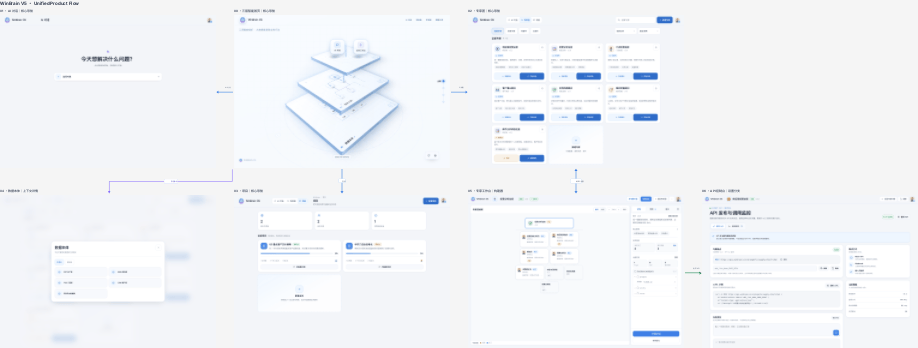
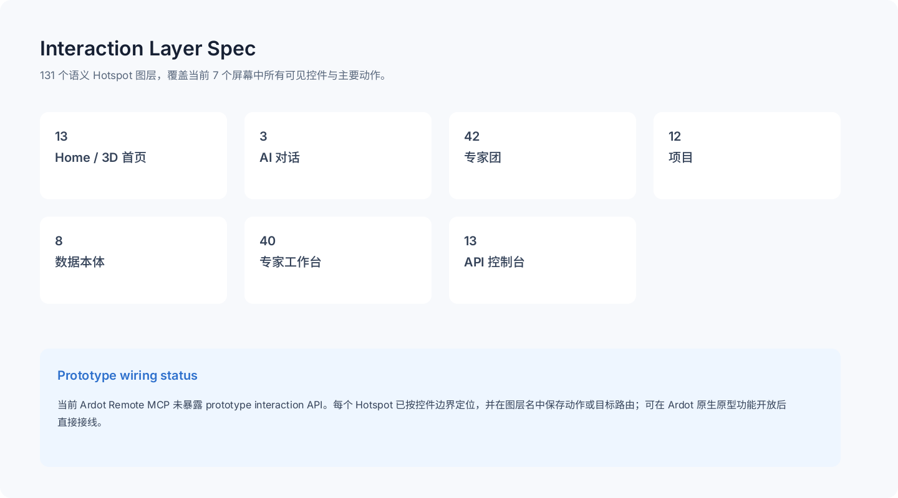

# WinBrain V5 Ardot 单画布案例

本案例记录一次真实的 `unified-product-flow` 与交互语义层工作流。输入是本地静态 Web 原型压缩包，目标是在腾讯设计 Ardot 中建立一个可审查的单页产品流。

Ardot 文件：<https://ardot.tencent.com/file/719360850014780>



## 最终结果

| 指标 | 结果 |
| --- | ---: |
| Ardot Page | 1 |
| 原尺寸屏幕根节点 | 7 |
| 路由连接器 | 6 |
| 交互容器 | 7 |
| 语义 Hotspot | 131 |
| Interaction Spec 图层 | 20 |
| 本次新增交互相关图层 | 158 |
| 设计变量定义 | 22 |
| 布局问题 | 0 |
| 最大平均像素差 | 0.1783 / 255 |

七个 1440×1024 屏幕保持原尺寸，集中到一个无限画布：

1. 三层智能首页
2. AI 对话
3. 专家团
4. 项目
5. 数据本体
6. 专家工作台
7. API 控制台

路由连接器覆盖首页到 AI 对话、专家团、项目和数据本体，专家团与专家工作台的往返，以及专家工作台到 API 控制台。其中“专家团 ↔ 专家工作台”按一个双向连接器计数，因此总数为 6。

## 交互语义层



每个屏幕根节点下增加一个透明 `Interactions` 容器。容器中的 Hotspot 与浏览器运行时可见控件边界对齐，图层名保存控件文案以及原始 `data-action`、路由或本地状态动作。

Hotspot 分布：

- Home / 3D 首页：13
- AI 对话：3
- 专家团：42
- 项目：12
- 数据本体：8
- 专家工作台：40
- API 控制台：13

这些图层不会改变像素。它们让设计师可以在图层面板中定位每个交互区域，并为后续原型接线保留动作语义。

## 3D Scroll World 行为

源页面使用 GSAP ScrollTrigger 实现连续滚动时间线：

```text
overview → 数据本体 → 项目·专家 → 应用层 → overview
```

关键参数：

- `pin: true`
- `scrub: 0.9`
- 滚动距离：`5.2 × viewport height`
- 章节位置：0%、25%、50%、75%
- 摄像机角度、平台位置、缩放、透明度和光束效果随滚动连续插值

## 能力边界

### Ardot Remote

本次连接的 Ardot Remote MCP 未暴露 motion 或 prototype-write 工具，因此不能通过 MCP 写入真实滚动、点击跳转或滚动驱动 3D 时间线。案例只保存屏幕、路由、Hotspot 和运动规格，不宣称已经生成真实原型交互。

`html_to_ardot` 对源页面和最小 HTML 都返回 `html2pagx convert did not return pagxUrl`。为保证交付，屏幕根节点使用高保真图像填充；变量、连接器、语义 Hotspot 和说明面板仍是原生 Ardot 图层。

### Figma 官方能力核验

通过 Exa 检索并限定 Figma 官方域名后，结论是：

- Figma Design 支持纵向滚动、固定和 Sticky 对象、Scroll to，以及 Smart Animate 近似视差。
- Figma Sites 的 `Scroll transform` 可以随滚动改变位置、缩放、透明度和旋转。
- Figma Sites Code Layer 支持 React、自定义交互和动画，也可以从现有设计转换为代码层。
- Figma MCP 官方文档确认可写入 Figma Design 原生图层，但没有承诺通过 MCP 写入 Figma Sites Code Layer 或 Scroll transform。

官方来源：

1. [Figma Sites interactions](https://help.figma.com/hc/en-us/articles/35895820755095-Figma-Sites-collection-Add-interactions-to-a-website)
2. [Figma Sites Code Layers](https://help.figma.com/hc/en-us/articles/31242824165143-Guide-to-code-layers-in-Figma-Sites)
3. [Figma prototype scrolling](https://help.figma.com/hc/en-us/articles/360039818734-Prototype-scroll-and-overflow-behavior)
4. [Figma Smart Animate](https://help.figma.com/hc/en-us/articles/360039818874-Smart-animate-layers-between-frames)
5. [Figma MCP write to canvas](https://developers.figma.com/docs/figma-mcp-server/write-to-canvas/)

## 过程教训

多屏输入必须先解析为 `unified-product-flow`，不能先创建多个 Page 再补救。正确顺序是：

1. 盘点屏幕根节点并分类。
2. 复用一个目标 Page。
3. 原尺寸移动并平铺所有屏幕。
4. 添加真实路由连接器。
5. 确认所有源 Page 已为空。
6. 删除空 Page，并验证最终 Page 数等于 1。
7. 导出缩略总览，再逐屏和逐连接器检查。

仓库不包含原始压缩包、OAuth 状态、API 密钥或本机绝对路径。
